# CV Analysis with ML Prediction - Extended Architecture

## Enhanced System Architecture with ML Prediction


## ML Prediction Pipeline


## Feature Engineering for ML Prediction


## ML Models Architecture


## Database Schema for ML Predictions


## ML Training Data Flow


## Prediction Algorithms

### 1. Quantitative Analysis
```python
# Linear calibration curve
concentration = (peak_current - intercept) / slope

# Multi-component analysis
concentrations = solve_linear_system(peak_matrix, current_vector)

# Non-linear calibration
concentration = polynomial_fit(peak_current, calibration_coefficients)
```

### 2. Concentration Prediction
```python
# Feature-based regression
concentration = ensemble_regressor.predict(features)

# Uncertainty quantification
uncertainty = std(bootstrap_predictions)

# Confidence intervals
ci_lower, ci_upper = quantile_regression(features, [0.025, 0.975])
```

### 3. Substance Classification
```python
# Multi-class classification
substance_probs = classifier.predict_proba(features)

# Similarity matching
similarity_scores = cosine_similarity(features, reference_database)

# Ensemble voting
final_prediction = voting_classifier.predict(features)
```

## Performance Metrics for ML Models

```mermaid
graph LR
    subgraph "Regression Metrics"
        A1[R² Score]
        A2[RMSE]
        A3[MAE]
        A4[MAPE]
    end
    
    subgraph "Classification Metrics"
        B1[Accuracy]
        B2[Precision]
        B3[Recall]
        B4[F1-Score]
        B5[AUC-ROC]
    end
    
    subgraph "Cross-Validation"
        C1[K-Fold CV]
        C2[Stratified CV]
        C3[Time Series CV]
    end
    
    subgraph "Business Metrics"
        D1[Detection Limit]
        D2[Linear Range]
        D3[Prediction Speed]
        D4[Model Size]
    end
```



## Real-time Prediction Integration


## API Endpoints for ML Predictions


---
*Extended Architecture with ML Prediction*  
*Version: 1.1*  
*Date: August 15, 2025*
