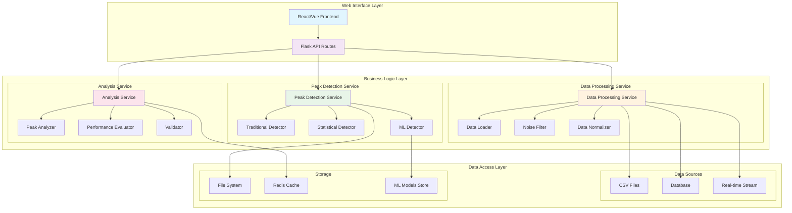
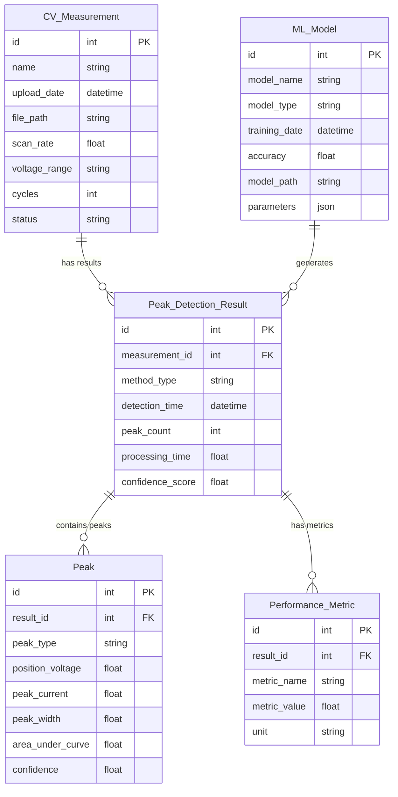
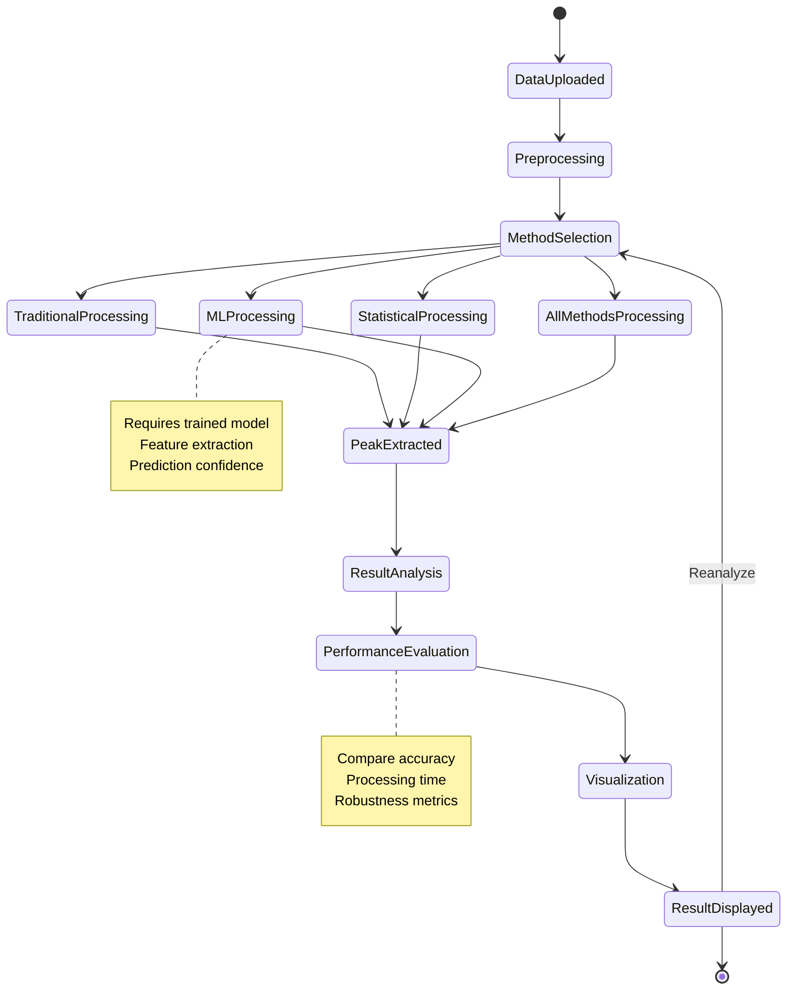
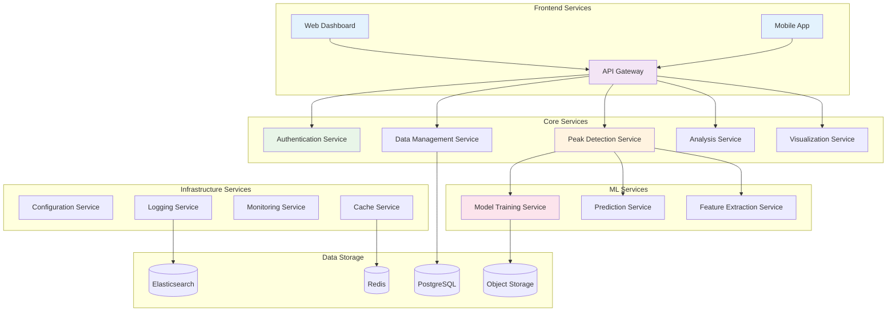
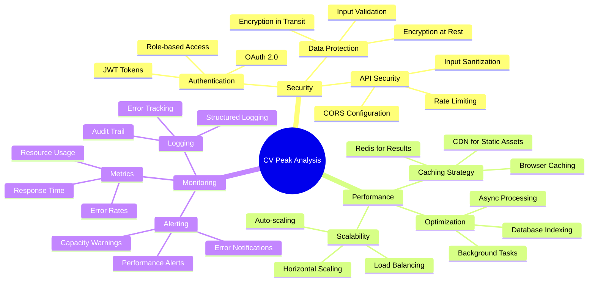
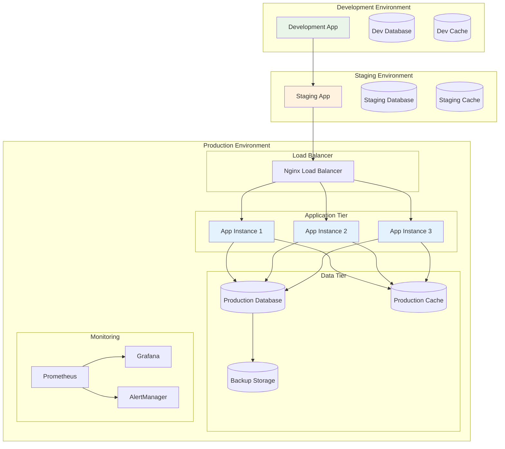

# CV Peak Analysis - Technical Architecture

## Component Interaction Diagram

## Database Schema Design

## State Management Flow

## Microservices Architecture (Future Scaling)

## Security & Performance Considerations

## Deployment Architecture

---
*Technical Architecture Document*  
*Version: 1.0*  
*Date: August 15, 2025*
