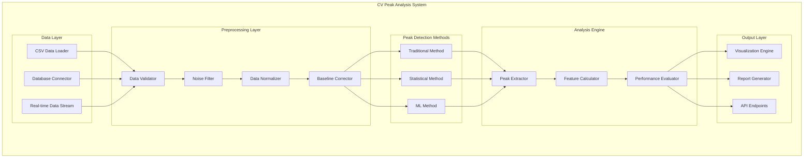
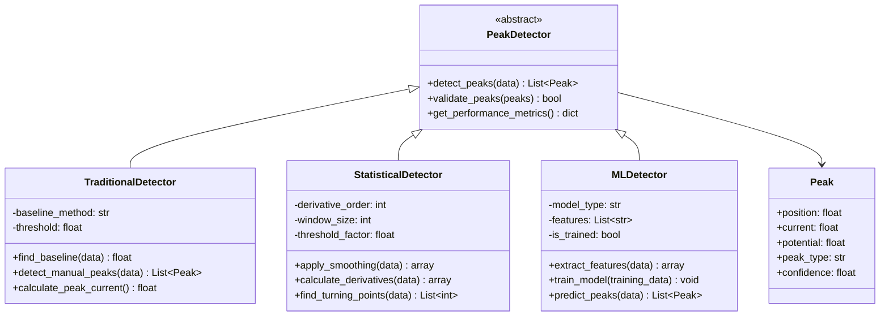
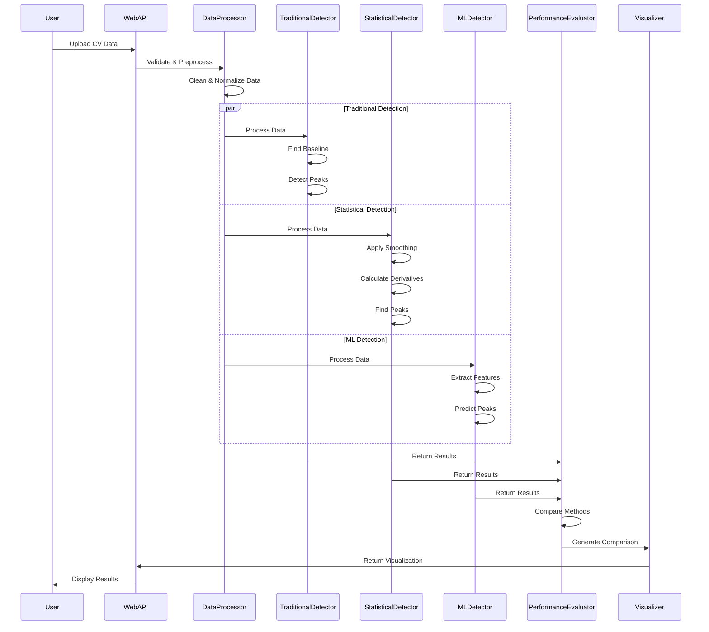
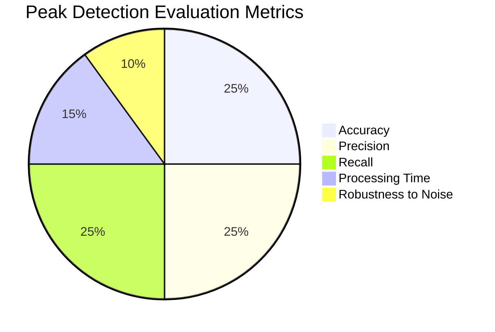
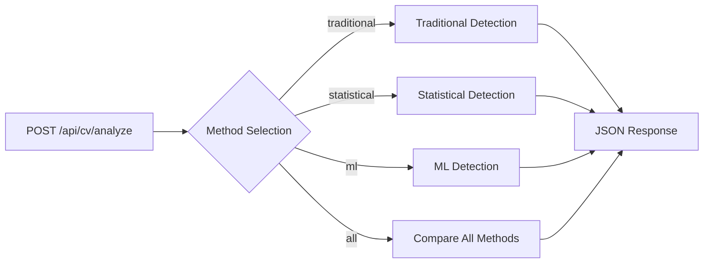

# CV Peak Analysis - System Design Plan

## Overview
แผนการพัฒนาระบบวิเคราะห์ Peak ใน Cyclic Voltammetry (CV) โดยใช้เทคนิคหลากหลายเพื่อเปรียบเทียบประสิทธิภาพ

## System Architecture



## Peak Detection Methods Detail



## Data Flow Diagram



## File Structure Plan

```
src/ai/cv_analysis/
├── __init__.py
├── peak_detection/
│   ├── __init__.py
│   ├── base_detector.py          # Abstract base class
│   ├── traditional_detector.py   # Baseline + manual method
│   ├── statistical_detector.py   # Derivative + threshold method
│   └── ml_detector.py            # Machine learning method
├── preprocessing/
│   ├── __init__.py
│   ├── data_loader.py           # Load CV data from various sources
│   ├── noise_filter.py          # Remove noise and artifacts
│   └── normalizer.py            # Data normalization
├── analysis/
│   ├── __init__.py
│   ├── peak_analyzer.py         # Peak feature extraction
│   ├── performance_evaluator.py # Compare method performance
│   └── validator.py             # Validate peak detection results
├── prediction/
│   ├── __init__.py
│   ├── feature_extractor.py     # Extract features for ML prediction
│   ├── quantitative_analyzer.py # Quantitative analysis & calibration
│   ├── concentration_predictor.py # Concentration prediction models
│   ├── substance_classifier.py  # Substance classification
│   └── model_trainer.py         # ML model training utilities
├── visualization/
│   ├── __init__.py
│   ├── cv_plotter.py           # Plot CV curves with peaks
│   ├── comparison_plotter.py    # Compare detection methods
│   └── prediction_plotter.py    # Visualize prediction results
└── models/
    ├── __init__.py
    ├── peak_model.py           # Peak data model
    ├── analysis_result.py      # Analysis result model
    ├── prediction_model.py     # Prediction result model
    └── calibration_model.py    # Calibration data model
```

## Implementation Phases

### Phase 1: Foundation (Week 1)
- [ ] Create base data models (Peak, AnalysisResult)
- [ ] Implement data loader and preprocessing
- [ ] Set up basic project structure

### Phase 2: Traditional Method (Week 2)
- [ ] Implement baseline detection
- [ ] Manual peak detection algorithm
- [ ] Basic visualization

### Phase 3: Statistical Method (Week 3)
- [ ] Derivative-based peak detection
- [ ] Threshold and filtering algorithms
- [ ] Smoothing and noise reduction

### Phase 4: ML Method (Week 4)
- [ ] Feature extraction for ML
- [ ] Train peak detection model
- [ ] Implement ML-based detector

### Phase 5: ML Prediction Models (Week 5)
- [ ] Feature engineering for prediction
- [ ] Quantitative analysis models
- [ ] Concentration prediction algorithms
- [ ] Substance classification models

### Phase 6: Integration & Comparison (Week 6)
- [ ] Performance evaluation framework
- [ ] Method comparison tools
- [ ] Prediction accuracy validation
- [ ] Web interface integration

## Performance Metrics



## Technical Requirements

### Dependencies
```python
# Core scientific computing
numpy>=1.21.0
scipy>=1.7.0
pandas>=1.3.0

# Machine learning
scikit-learn>=1.0.0
tensorflow>=2.6.0  # or pytorch

# Visualization
matplotlib>=3.4.0
plotly>=5.0.0

# Signal processing
pywavelets>=1.1.0
```

### Hardware Requirements
- RAM: Minimum 8GB (16GB recommended for ML training)
- CPU: Multi-core processor for parallel processing
- Storage: 1GB for models and sample data

## API Design



## Configuration Options

```yaml
# config/cv_analysis.yaml
peak_detection:
  traditional:
    baseline_method: "linear"  # linear, polynomial, spline
    threshold_factor: 0.1
  
  statistical:
    derivative_order: 2
    window_size: 5
    smoothing_method: "savgol"  # savgol, moving_average
  
  ml:
    model_type: "random_forest"  # random_forest, svm, neural_network
    feature_set: ["current", "potential", "derivatives"]
    training_data_path: "data/training/"

visualization:
  plot_style: "scientific"
  color_scheme: "viridis"
  interactive: true
```

## Next Steps
1. Review and approve this design plan
2. Set up development environment
3. Begin Phase 1 implementation
4. Create sample test data
5. Implement continuous integration/testing

---
*Created: August 15, 2025*  
*Version: 1.0*  
*Author: Development Team*
