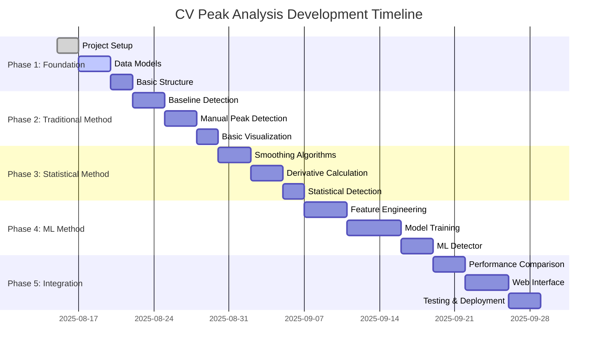
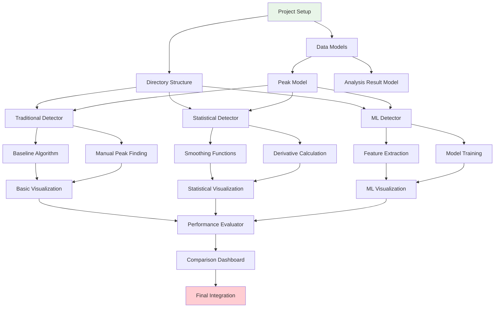
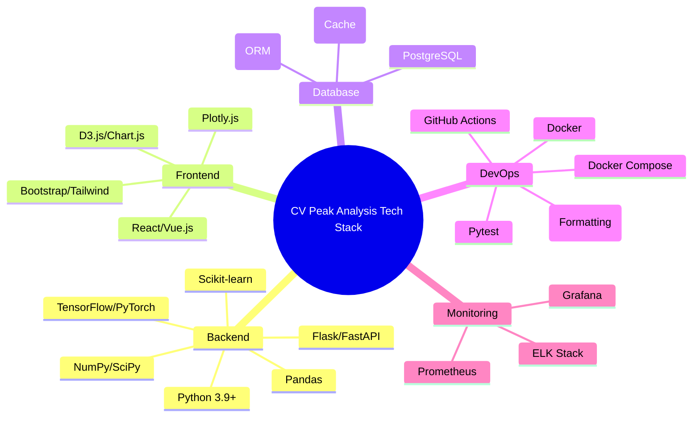
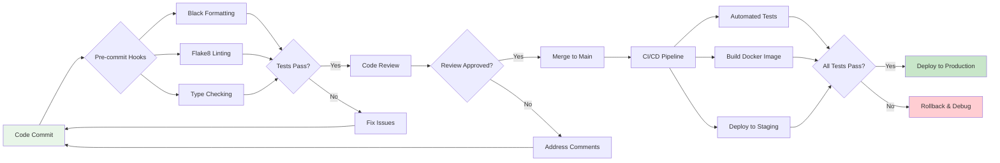
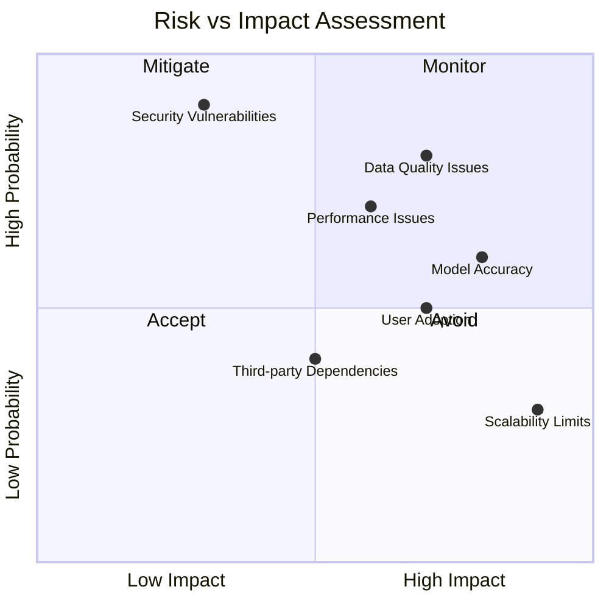
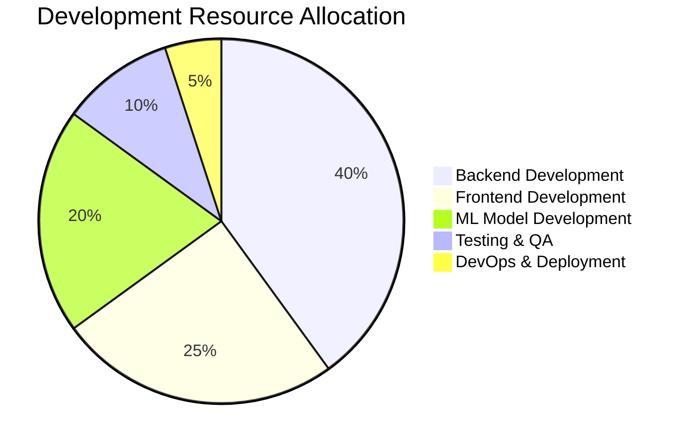
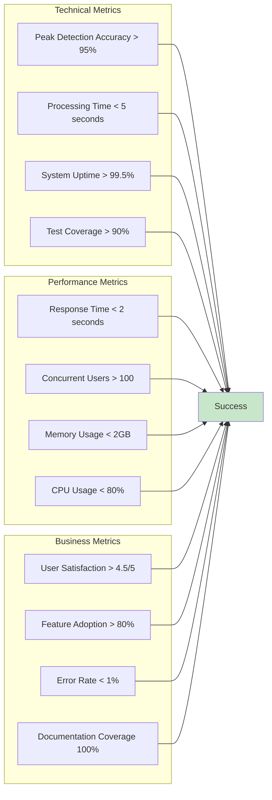

# CV Peak Analysis - Implementation Roadmap

## Development Timeline & Milestones



## Task Breakdown & Dependencies



## Technical Stack & Tools



## Code Quality & Standards



## API Endpoints Design

```mermaid
graph TB
    subgraph "CV Analysis API v1"
        subgraph "Data Management"
            A1[POST /api/v1/data/upload]
            A2[GET /api/v1/data/list]
            A3[GET /api/v1/data/{id}]
            A4[DELETE /api/v1/data/{id}]
        end
        
        subgraph "Peak Detection"
            B1[POST /api/v1/peaks/detect/traditional]
            B2[POST /api/v1/peaks/detect/statistical]
            B3[POST /api/v1/peaks/detect/ml]
            B4[POST /api/v1/peaks/detect/compare]
        end
        
        subgraph "Analysis"
            C1[GET /api/v1/analysis/{id}/results]
            C2[GET /api/v1/analysis/{id}/performance]
            C3[GET /api/v1/analysis/{id}/visualization]
        end
        
        subgraph "Model Management"
            D1[GET /api/v1/models/list]
            D2[POST /api/v1/models/train]
            D3[GET /api/v1/models/{id}/metrics]
        end
    end
    
    style A1 fill:#e3f2fd
    style B4 fill:#e8f5e8
    style C3 fill:#fff3e0
    style D2 fill:#fce4ec
```

## Testing Strategy

```mermaid
pyramid
    title Testing Pyramid
    
    layer "E2E Tests"
        "User Journey Tests"
        "API Integration Tests"
        "Browser Automation"
    
    layer "Integration Tests"
        "Database Tests"
        "Service Integration"
        "API Endpoint Tests"
    
    layer "Unit Tests"
        "Algorithm Tests"
        "Model Tests"
        "Utility Function Tests"
        "Component Tests"
```

## Risk Assessment & Mitigation



## Resource Allocation



## Success Metrics & KPIs



## Next Immediate Actions

### Week 1 (August 15-22, 2025)
1. **Day 1-2**: Set up project structure and development environment
2. **Day 3-4**: Implement basic data models (Peak, AnalysisResult)
3. **Day 5-7**: Create data loader and basic preprocessing pipeline

### Week 2 (August 22-29, 2025)
1. **Day 1-3**: Implement traditional baseline detection algorithm
2. **Day 4-5**: Build manual peak detection system
3. **Day 6-7**: Create basic visualization for traditional method

### Development Environment Setup Checklist
- [ ] Clone repository and create feature branch
- [ ] Set up Python virtual environment
- [ ] Install required dependencies
- [ ] Configure IDE/editor settings
- [ ] Set up pre-commit hooks
- [ ] Create initial test structure
- [ ] Set up local database
- [ ] Configure environment variables

---
*Implementation Roadmap*  
*Version: 1.0*  
*Created: August 15, 2025*
