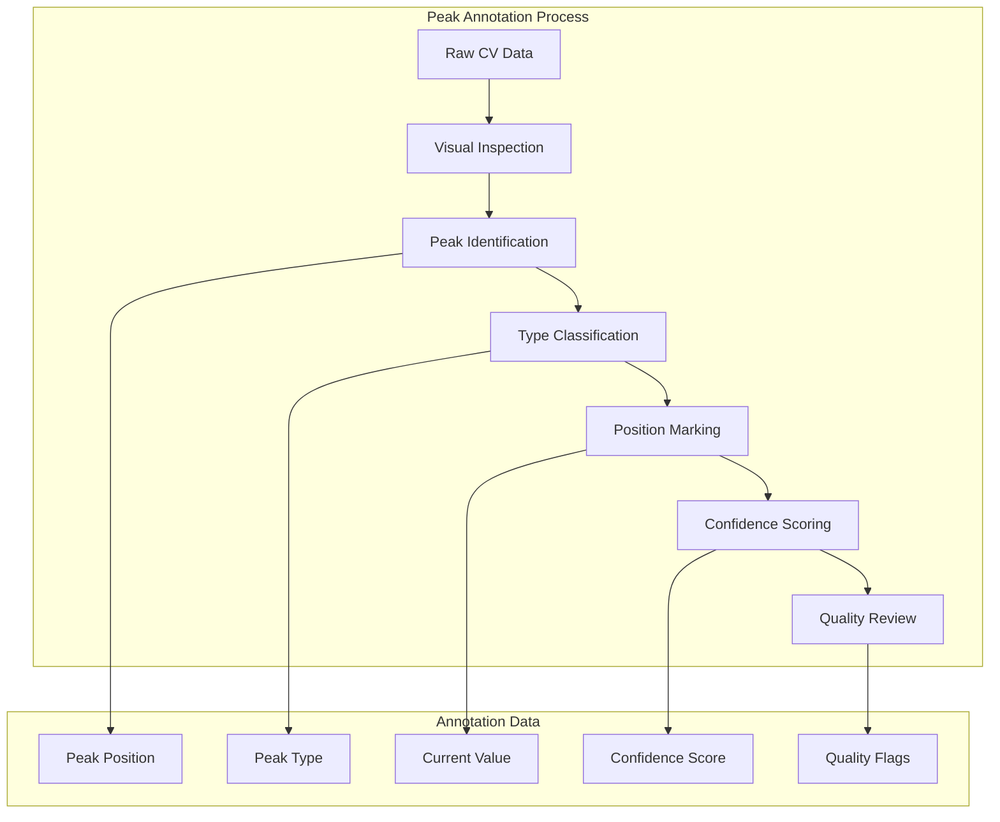
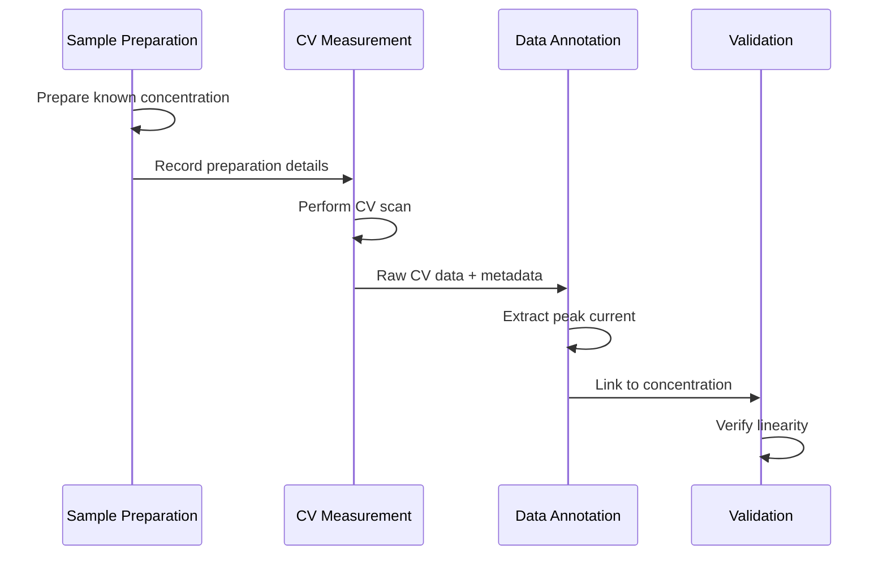
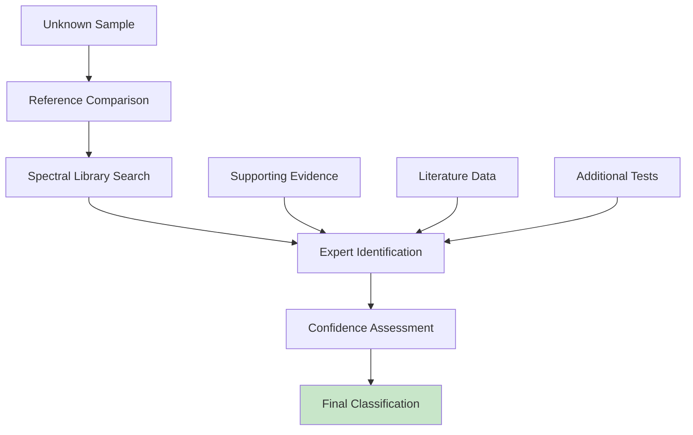
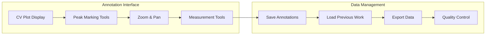
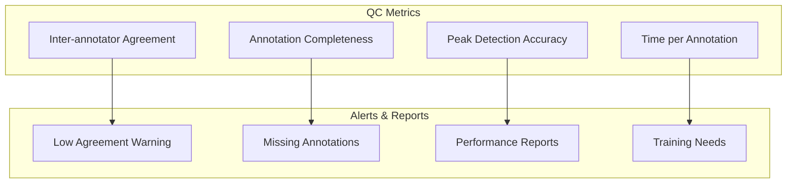
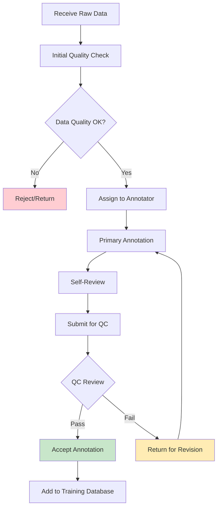
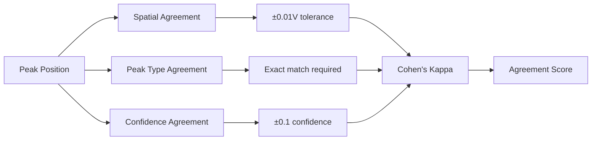
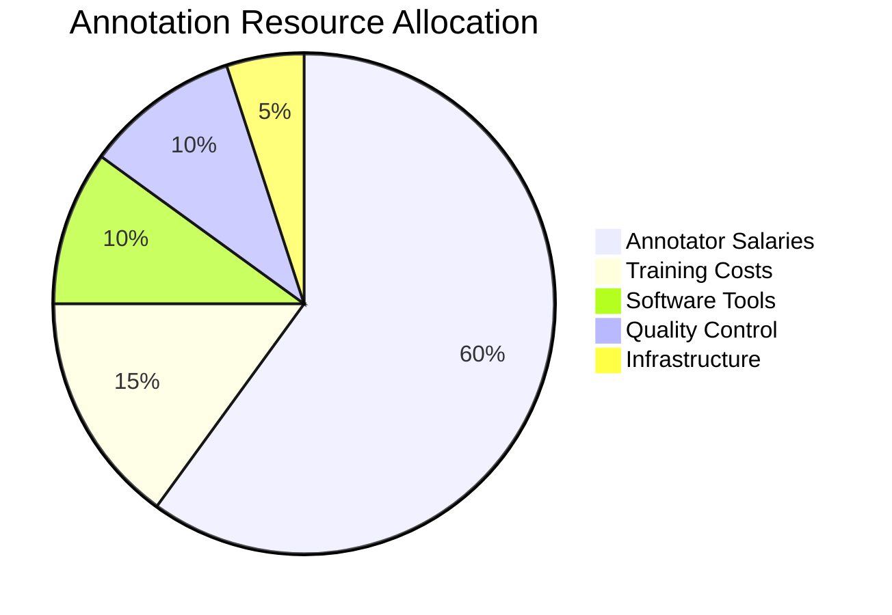

# Data Annotation Guidelines & Tools

## Overview
แนวทางการ annotate ข้อมูลสำหรับการ training ML models ในระบบ CV Peak Analysis

## Annotation Types และ Standards

### 1. Peak Detection Annotations



**Peak Annotation Format:**
```json
{
  "peak_id": "peak_001",
  "type": "anodic",  // anodic, cathodic, undefined
  "position": {
    "voltage": 0.252,  // V vs reference
    "current": 1.23e-5  // A
  },
  "characteristics": {
    "height": 1.23e-5,
    "width_fwhm": 0.045,
    "area": 2.34e-6,
    "asymmetry": 1.15
  },
  "confidence": 0.95,  // 0-1 scale
  "quality_flags": {
    "well_defined": true,
    "baseline_clear": true,
    "noise_level": "low",
    "interference": false
  },
  "annotator": "expert_001",
  "annotation_time": "2025-08-15T10:30:00Z"
}
```

### 2. Quantitative Analysis Annotations



**Quantitative Annotation Format:**
```json
{
  "sample_id": "std_ferrocyanide_001",
  "preparation": {
    "substance": "K4[Fe(CN)6]",
    "nominal_concentration": 1.0e-3,  // M
    "actual_concentration": 9.97e-4,  // M (corrected)
    "uncertainty": 0.02e-4,  // M
    "preparation_method": "volumetric_dilution",
    "solution_temperature": 25.0,  // °C
    "pH": 7.4,
    "ionic_strength": 0.1  // M KCl
  },
  "measurement_conditions": {
    "electrode": "glassy_carbon",
    "reference": "Ag/AgCl",
    "scan_rate": 0.1,  // V/s
    "potential_window": [-0.2, 0.6],  // V
    "cycles": 3
  },
  "results": {
    "peak_current": 12.45e-6,  // A
    "peak_potential": 0.245,  // V
    "current_density": 39.7,  // µA/cm²
    "electrode_area": 0.0314  // cm²
  },
  "quality_control": {
    "replicate_number": 3,
    "rsd_current": 2.1,  // %
    "baseline_stable": true,
    "contamination": false
  }
}
```

### 3. Substance Classification Annotations



**Classification Annotation Format:**
```json
{
  "substance_id": "dopamine_sample_045",
  "identification": {
    "primary_substance": "dopamine",
    "chemical_formula": "C8H11NO2",
    "cas_number": "51-61-6",
    "confidence": 0.92,
    "identification_method": "cv_fingerprint_match"
  },
  "electrochemical_signature": {
    "oxidation_potential": 0.185,  // V vs Ag/AgCl
    "reduction_potential": 0.145,  // V
    "peak_separation": 0.040,  // V
    "current_ratio": 0.98,  // Ipc/Ipa
    "characteristic_peaks": [
      {"type": "oxidation", "potential": 0.185, "mechanism": "dopamine_quinone"}
    ]
  },
  "interferences": {
    "ascorbic_acid": "separated",
    "uric_acid": "potential_overlap",
    "background_electrolyte": "no_interference"
  },
  "literature_reference": {
    "doi": "10.1016/j.electacta.2020.xxxxx",
    "conditions_match": true,
    "reported_potential": 0.180  // V vs Ag/AgCl
  }
}
```

## Annotation Tools & Software

### 1. Custom Peak Annotation Tool



**Tool Features:**
- **Interactive plotting** with plotly/matplotlib
- **Point-and-click** peak marking
- **Automatic feature calculation** (height, width, area)
- **Undo/redo** functionality
- **Batch processing** support
- **Multi-annotator** workflow
- **Quality assessment** metrics

### 2. Web-based Annotation Platform

```html
<!DOCTYPE html>
<html>
<head>
    <title>CV Peak Annotation Tool</title>
    <script src="https://cdn.plot.ly/plotly-latest.min.js"></script>
</head>
<body>
    <div id="cv-plot" style="width:800px;height:600px;"></div>
    <div id="annotation-panel">
        <h3>Peak Annotations</h3>
        <div id="peak-list"></div>
        <button onclick="savePeaks()">Save Annotations</button>
    </div>
</body>
</html>
```

### 3. Quality Control Dashboard



## Annotator Training Program

### 1. Training Curriculum

```mermaid
journey
    title Annotator Training Journey
    section Week 1: Fundamentals
      Learn CV Theory: 5: Trainee
      Practice on Clean Data: 4: Trainee
      Basic Peak Identification: 3: Trainee
    section Week 2: Complex Cases
      Noisy Signal Analysis: 3: Trainee
      Multiple Peak Systems: 2: Trainee
      Edge Case Handling: 2: Trainee
    section Week 3: Quality Control
      Consistency Training: 4: Trainee
      Expert Comparison: 5: Trainee
      Final Certification: 5: Trainee
```

### 2. Certification Requirements

**Level 1 Annotator:**
- ✅ Complete basic training (20 hours)
- ✅ Achieve >90% agreement on test set
- ✅ Annotate 100 practice curves
- ✅ Pass written examination

**Level 2 Expert Annotator:**
- ✅ Complete advanced training (40 hours)
- ✅ Achieve >95% agreement on test set
- ✅ Annotate 500+ complex curves
- ✅ Mentor other annotators

**Quality Control Reviewer:**
- ✅ Level 2 certification + experience
- ✅ Statistical quality control training
- ✅ Inter-annotator agreement analysis
- ✅ Decision authority on difficult cases

## Annotation Workflow

### 1. Standard Operating Procedure



### 2. Batch Processing Workflow

```python
def batch_annotation_workflow(cv_files: List[str], 
                            annotators: List[str],
                            batch_size: int = 10) -> dict:
    """
    Manage batch annotation process
    
    Returns:
        dict: Progress and quality metrics
    """
    
    # Distribute work among annotators
    batches = create_annotation_batches(cv_files, batch_size)
    
    # Assign batches to annotators
    assignments = assign_to_annotators(batches, annotators)
    
    # Track progress
    progress = monitor_annotation_progress(assignments)
    
    # Quality control
    qc_results = perform_quality_control(completed_annotations)
    
    return {
        'progress': progress,
        'quality': qc_results,
        'timeline': estimated_completion
    }
```

## Inter-Annotator Agreement

### 1. Agreement Metrics



**Agreement Calculation:**
```python
def calculate_peak_agreement(annotations1: List[dict], 
                           annotations2: List[dict]) -> dict:
    """
    Calculate inter-annotator agreement for peak annotations
    """
    
    # Spatial agreement (peak positions within tolerance)
    spatial_agreement = calculate_spatial_overlap(annotations1, annotations2)
    
    # Type agreement (anodic/cathodic classification)
    type_agreement = calculate_type_agreement(annotations1, annotations2)
    
    # Overall Cohen's kappa
    kappa = cohen_kappa(annotations1, annotations2)
    
    return {
        'spatial_agreement': spatial_agreement,
        'type_agreement': type_agreement,
        'cohens_kappa': kappa,
        'overall_score': (spatial_agreement + type_agreement + kappa) / 3
    }
```

### 2. Quality Thresholds

| **Agreement Type** | **Minimum** | **Target** | **Excellent** |
|-------------------|-------------|------------|---------------|
| **Peak Position** | 85% | 90% | 95% |
| **Peak Type** | 90% | 95% | 98% |
| **Overall Kappa** | 0.8 | 0.85 | 0.9 |

## Annotation Database Schema

```sql
-- Annotation projects
CREATE TABLE annotation_projects (
    id SERIAL PRIMARY KEY,
    project_name VARCHAR(100),
    description TEXT,
    start_date DATE,
    target_completion DATE,
    annotation_guidelines_version VARCHAR(10)
);

-- Annotators
CREATE TABLE annotators (
    id SERIAL PRIMARY KEY,
    username VARCHAR(50) UNIQUE,
    full_name VARCHAR(100),
    certification_level INTEGER,
    training_completion_date DATE,
    active_status BOOLEAN DEFAULT true
);

-- Annotation tasks
CREATE TABLE annotation_tasks (
    id SERIAL PRIMARY KEY,
    project_id INTEGER REFERENCES annotation_projects(id),
    cv_file_path VARCHAR(255),
    assigned_annotator INTEGER REFERENCES annotators(id),
    assignment_date TIMESTAMP,
    due_date TIMESTAMP,
    status VARCHAR(20), -- 'assigned', 'in_progress', 'completed', 'reviewed'
    priority INTEGER DEFAULT 3
);

-- Peak annotations
CREATE TABLE peak_annotations (
    id SERIAL PRIMARY KEY,
    task_id INTEGER REFERENCES annotation_tasks(id),
    annotator_id INTEGER REFERENCES annotators(id),
    peak_data JSONB,
    annotation_time TIMESTAMP,
    time_spent_minutes INTEGER,
    confidence_score FLOAT,
    notes TEXT
);

-- Quality control reviews
CREATE TABLE qc_reviews (
    id SERIAL PRIMARY KEY,
    annotation_id INTEGER REFERENCES peak_annotations(id),
    reviewer_id INTEGER REFERENCES annotators(id),
    review_date TIMESTAMP,
    approval_status VARCHAR(20), -- 'approved', 'rejected', 'needs_revision'
    feedback TEXT,
    agreement_score FLOAT
);

-- Inter-annotator agreement tracking
CREATE TABLE agreement_metrics (
    id SERIAL PRIMARY KEY,
    project_id INTEGER REFERENCES annotation_projects(id),
    annotator1_id INTEGER REFERENCES annotators(id),
    annotator2_id INTEGER REFERENCES annotators(id),
    sample_size INTEGER,
    spatial_agreement FLOAT,
    type_agreement FLOAT,
    cohens_kappa FLOAT,
    calculation_date TIMESTAMP
);
```

## Cost & Time Estimation

### 1. Annotation Time Estimates

| **Data Type** | **Time per Sample** | **Samples Needed** | **Total Hours** |
|---------------|-------------------|-------------------|-----------------|
| **Simple CV** | 5 minutes | 1,000 | 83 hours |
| **Complex CV** | 15 minutes | 500 | 125 hours |
| **Quantitative** | 10 minutes | 500 | 83 hours |
| **Classification** | 20 minutes | 1,000 | 333 hours |
| **QC Review** | 3 minutes | 3,000 | 150 hours |
| **Total** | - | 6,000 | **774 hours** |

### 2. Resource Requirements



**Cost Breakdown:**
- **Primary Annotators**: 2-3 people × 400 hours × $25/hour = $20,000-30,000
- **Expert Reviewers**: 1 person × 200 hours × $50/hour = $10,000
- **Training Program**: $5,000
- **Software Development**: $10,000
- **Total Estimated Cost**: $45,000-55,000

---
*Data Annotation Guidelines*  
*Version: 1.0*  
*Created: August 15, 2025*
