# EIS Feasibility Analysis for STM32H743 Potentiostat

## Overview
การวิเคราะห์ความเป็นไปได้ในการใช้ STM32H743 potentiostat สำหรับ Electrochemical Impedance Spectroscopy (EIS)

## EIS vs CV Technical Comparison

### 1. Fundamental Differences


### 2. Hardware Requirements Comparison

| **Parameter** | **CV Requirements** | **EIS Requirements** | **STM32H743 Capability** |
|---------------|-------------------|---------------------|--------------------------|
| **Voltage Control** | DC sweep (0.01-1 V/s) | AC perturbation (1-10 mV) | ✅ DAC 12-bit, sufficient |
| **Current Measurement** | DC current (nA-mA) | AC current + phase | ⚠️ ADC only, no phase |
| **Frequency Range** | N/A | 0.01 Hz - 1 MHz | ❌ Limited by software |
| **Phase Detection** | Not required | Critical (±0.1°) | ❌ No dedicated hardware |
| **Signal Generator** | Ramp/step | Sine wave | ⚠️ DAC can generate |
| **Lock-in Amplifier** | Not required | Essential | ❌ No hardware support |

## STM32H743 Capabilities for EIS

### 1. What We Have ✅


**Positive Capabilities:**
- **High-speed DAC**: Can generate sine waves up to ~100 kHz
- **Fast ADC**: 16-bit resolution with high sampling rate
- **Powerful CPU**: 480 MHz for real-time signal processing
- **DSP support**: Hardware-accelerated FFT and filtering
- **Multiple timers**: For precise frequency control

### 2. What We're Missing ❌


**Critical Missing Components:**
- **Phase detection**: No dedicated phase meter hardware
- **Lock-in amplifier**: Essential for EIS measurements
- **Precision frequency reference**: For stable AC generation
- **Wide bandwidth**: Commercial EIS: 10 µHz - 10 MHz

## EIS Implementation Challenges

### 1. Technical Challenges

```mermaid
flowchart TD
    A[EIS Challenges] --> B[Phase Measurement]
    A --> C[Low Frequency Generation]
    A --> D[Signal-to-Noise Ratio]
    A --> E[Frequency Stability]
    
    B --> B1[Need ±0.1° accuracy]
    B --> B2[STM32: Software-based only]
    
    C --> C1[Need 0.01 Hz capability]
    C --> C2[STM32: Limited by timer resolution]
    
    D --> D1[Need µV/nA sensitivity]
    D --> D2[STM32: Limited by ADC noise]
    
    E --> E1[Need ppm stability]
    E --> E2[STM32: Crystal-dependent]
    
    style B1 fill:#ffecb3
    style C1 fill:#ffecb3
    style D1 fill:#ffecb3
    style E1 fill:#ffecb3
    style B2 fill:#ffcdd2
    style C2 fill:#ffcdd2
    style D2 fill:#ffcdd2
    style E2 fill:#ffcdd2
```



### 2. Software-Based EIS Approach


**Software Implementation:**
```python
def software_eis_measurement(frequency: float, amplitude: float) -> complex:
    """
    Software-based EIS measurement
    Limited accuracy compared to dedicated hardware
    """
    
    # Generate reference sine wave
    reference_signal = generate_sine_wave(frequency, amplitude)
    
    # Apply to electrode and measure response
    response_signal = measure_current_response(reference_signal)
    
    # Digital signal processing
    reference_fft = fft(reference_signal)
    response_fft = fft(response_signal)
    
    # Calculate impedance
    impedance = response_fft / reference_fft
    magnitude = abs(impedance)
    phase = angle(impedance)
    
    return impedance
```

## Feasibility Assessment

### 1. Limited EIS Capability ⚠️


**What's Possible:**
- **Frequency range**: ~1 Hz to 10 kHz (limited)
- **Accuracy**: ±5-10% magnitude, ±2-5° phase
- **Applications**: Basic battery testing, simple impedance screening
- **Resolution**: Moderate impedance resolution

**What's Not Possible:**
- **Wide frequency range**: 10 µHz - 10 MHz
- **High precision**: ±0.1% magnitude, ±0.1° phase
- **Low frequencies**: <1 Hz reliable measurements
- **Professional EIS**: Research-grade accuracy

### 2. Comparison with Commercial EIS

| **Parameter** | **Commercial EIS** | **STM32-based EIS** | **Ratio** |
|---------------|-------------------|---------------------|-----------|
| **Frequency Range** | 10 µHz - 10 MHz | 1 Hz - 10 kHz | 1:1000 |
| **Phase Accuracy** | ±0.1° | ±2-5° | 1:20-50 |
| **Magnitude Accuracy** | ±0.1% | ±5-10% | 1:50-100 |
| **Cost** | $50,000-200,000 | $500-1,000 | 1:100-400 |

## Recommended Approach

### 🎯 **Option 1: Basic EIS Implementation (Recommended)**


**Implementation Strategy:**
- Add EIS as **supplementary feature** to CV system
- **Clearly document limitations** to users
- Focus on **1-10 kHz range** where STM32 performs best
- Use for **basic impedance screening** and **education**

**Development Effort:** 🟡 Medium (2-3 months)
- Reuse existing hardware completely
- Add DSP-based signal processing
- Extend web interface for EIS plots

### 🎯 **Option 2: Hybrid System (Future)**


**Hardware Additions Needed:**
- **Lock-in amplifier IC** (e.g., AD630)
- **Precision DDS** (Direct Digital Synthesis)
- **Phase detector** circuit
- **Additional analog frontend**

**Development Effort:** 🔴 High (6-12 months + hardware redesign)
- Significant hardware changes required
- New PCB design and testing
- Much higher complexity and cost

### 🎯 **Option 3: Professional EIS (Not Recommended)**


## EIS Software Architecture

### 1. Integration with Existing CV System


### 2. EIS-Specific Components

```python
class BasicEISMeasurement:
    """
    Software-based EIS implementation for STM32
    Limited accuracy but useful for basic applications
    """
    
    def __init__(self, freq_range=(1, 10000), points_per_decade=10):
        self.freq_range = freq_range
        self.points_per_decade = points_per_decade
        self.frequencies = self.generate_frequency_list()
    
    def run_eis_sweep(self) -> List[ImpedancePoint]:
        """Run EIS measurement across frequency range"""
        impedance_data = []
        
        for freq in self.frequencies:
            # Generate sine wave at frequency
            sine_wave = self.generate_sine_wave(freq)
            
            # Measure current response
            current_response = self.measure_response(sine_wave)
            
            # Calculate impedance
            impedance = self.calculate_impedance(sine_wave, current_response)
            
            impedance_data.append(ImpedancePoint(
                frequency=freq,
                magnitude=abs(impedance),
                phase=np.angle(impedance, deg=True)
            ))
        
        return impedance_data
    
    def calculate_impedance(self, voltage_signal, current_signal) -> complex:
        """Calculate impedance using FFT-based method"""
        # Apply windowing to reduce spectral leakage
        windowed_voltage = voltage_signal * np.hanning(len(voltage_signal))
        windowed_current = current_signal * np.hanning(len(current_signal))
        
        # FFT analysis
        voltage_fft = np.fft.fft(windowed_voltage)
        current_fft = np.fft.fft(windowed_current)
        
        # Find fundamental frequency component
        fundamental_idx = self.find_fundamental_frequency(voltage_fft)
        
        # Calculate impedance
        voltage_phasor = voltage_fft[fundamental_idx]
        current_phasor = current_fft[fundamental_idx]
        
        impedance = voltage_phasor / current_phasor
        
        return impedance
```

## Applications and Limitations

### 1. Suitable Applications ✅


### 2. Not Suitable For ❌

```mermaid
graph TB
    A[Not Suitable Applications] --> B[Precision Research]
    A --> C[Publication Quality]
    A --> D[Low Frequency Studies]
    A --> E[High Frequency Studies]
    
    B --> B1[<±1% accuracy needed]
    C --> C1[Journal requirements]
    D --> D1[<1 Hz measurements]
    E --> E1[>100 kHz measurements]
    
    style A fill:#ffcdd2
    style B1 fill:#ffcdd2
    style C1 fill:#ffcdd2
    style D1 fill:#ffcdd2
    style E1 fill:#ffcdd2
```



## Implementation Roadmap

### Phase 1: Proof of Concept (2 months)
- [ ] Implement basic sine wave generation
- [ ] Add FFT-based impedance calculation
- [ ] Create simple Nyquist plot visualization
- [ ] Test on known impedance components

### Phase 2: Integration (1 month)
- [ ] Integrate EIS into existing CV system
- [ ] Add frequency sweep capabilities
- [ ] Implement Bode plot visualization
- [ ] Create basic equivalent circuit fitting

### Phase 3: Validation (1 month)
- [ ] Compare with commercial EIS systems
- [ ] Document accuracy limitations
- [ ] Create user guidelines
- [ ] Publish performance specifications

## Final Recommendation

### 🎯 **Recommended Approach: "Limited EIS as Value-Add Feature"**


**Why This Approach:**

1. **Technical Feasibility** ✅
   - Use existing STM32 hardware completely
   - Software-only implementation
   - 1-10 kHz range achievable with reasonable accuracy

2. **Business Value** 💼
   - Additional feature without hardware cost
   - Educational market opportunity
   - Differentiator from simple potentiostats

3. **User Expectations** 👥
   - Clear documentation of limitations
   - Positioning as "basic EIS" not "research EIS"
   - Price point appropriate for capabilities

4. **Development Cost** 💰
   - Low incremental cost (2-3 months development)
   - High value-add for educational users
   - Foundation for future hardware upgrades

**Timeline:**
- After CV system is complete and stable
- 3-month development window
- Position as "bonus feature" not core capability

---
**สรุป**: STM32H743 สามารถทำ EIS ได้ในระดับพื้นฐาน (1 Hz - 10 kHz) เหมาะสำหรับการศึกษาและการใช้งานเบื้องต้น แต่ไม่เหมาะสำหรับงานวิจัยที่ต้องการความแม่นยำสูง

---
*EIS Feasibility Analysis*  
*Version: 1.0*  
*Created: August 15, 2025*
