# ML Training Data Collection & Strategy Plan

## Overview
แผนการเก็บข้อมูลและการ training สำหรับระบบ CV Peak Analysis และ ML Prediction

## Training Data Requirements

### 1. Data Categories และ Minimum Sample Size

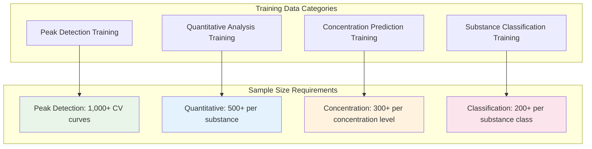

### 2. Data Collection Matrix

| **Data Type** | **Minimum Samples** | **Recommended** | **Priority** | **Collection Method** |
|---------------|---------------------|-----------------|--------------|----------------------|
| **Peak Detection** | 1,000 CV curves | 5,000+ | High | Synthetic + Real |
| **Standard Solutions** | 50 per substance | 100+ | Critical | Laboratory |
| **Concentration Series** | 300 per series | 500+ | High | Calibration runs |
| **Substance Library** | 200 per class | 500+ | Medium | Literature + Lab |
| **Noise Variations** | 200 curves | 1,000+ | High | Synthetic |
| **Scan Rate Variations** | 100 per rate | 200+ | Medium | Systematic study |

## Data Collection Strategy

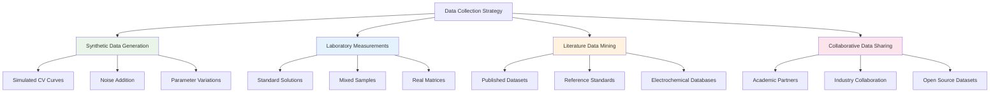

## Detailed Training Data Specifications

### 1. Peak Detection Training Data

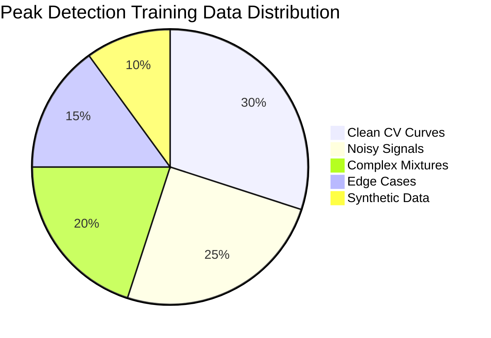

**Requirements:**
- **1,000-5,000 CV curves** with manually annotated peaks
- **Peak annotations**: position, type (anodic/cathodic), confidence
- **Signal quality**: clean, noisy, baseline drift, interference
- **Complexity levels**: single peak, multiple peaks, overlapping peaks

**Data Format:**
```json
{
  "cv_data": {
    "voltage": [array],
    "current": [array],
    "scan_rate": 0.1,
    "cycles": 3
  },
  "peaks": [
    {
      "type": "anodic",
      "voltage": 0.25,
      "current": 1.2e-5,
      "confidence": 0.95,
      "width": 0.05
    }
  ],
  "metadata": {
    "substance": "Fe(CN)6",
    "concentration": 1e-3,
    "temperature": 25,
    "electrode": "GCE"
  }
}
```

### 2. Quantitative Analysis Training Data

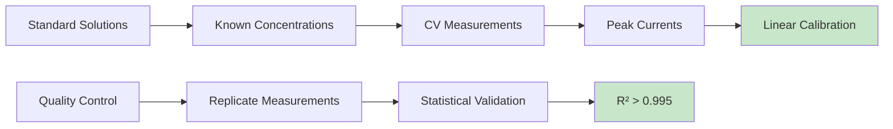

**Requirements per Substance:**
- **Minimum 50 calibration points** across linear range
- **5-7 concentration levels** minimum
- **3-5 replicates** per concentration
- **Detection limit** to **upper linear range**

**Priority Substances (Phase 1):**
1. **Ferrocyanide/Ferricyanide** (reference standard)
2. **Ascorbic Acid** (common analyte)
3. **Dopamine** (neurotransmitter)
4. **Glucose** (biosensor application)
5. **Heavy Metals** (Pb²⁺, Cd²⁺, Zn²⁺)

**Data Requirements:**
```python
# Example concentration series
concentrations = [1e-6, 5e-6, 1e-5, 5e-5, 1e-4, 5e-4, 1e-3]  # M
replicates = 5  # per concentration
total_per_substance = len(concentrations) * replicates  # 35 measurements
```

### 3. Concentration Prediction Training Data

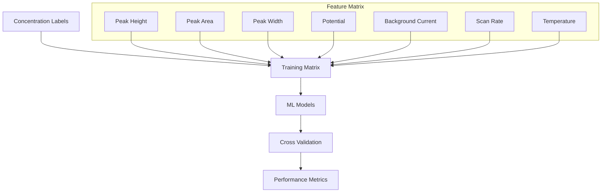

**Requirements:**
- **300-500 samples** per concentration range
- **Multiple scan rates** (0.02-1.0 V/s)
- **Temperature variations** (15-35°C)
- **Different electrode conditions**
- **Matrix effects** (different background electrolytes)

**Feature Engineering:**
- **Electrochemical features**: Peak current, potential, width, asymmetry
- **Signal features**: Baseline, noise level, signal-to-noise ratio
- **Experimental conditions**: Scan rate, temperature, pH
- **Derived features**: Normalized values, ratios, interactions

### 4. Substance Classification Training Data

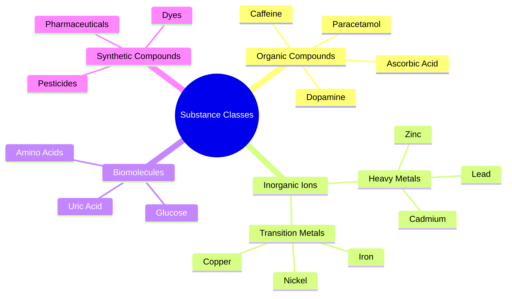

**Requirements per Substance Class:**
- **200-500 CV measurements** per substance
- **Various concentrations** (3-5 levels)
- **Different conditions** (pH, temperature, scan rate)
- **Potential interferences** included

**Priority Classification Tasks:**
1. **Binary Classification**: Target vs Non-target
2. **Multi-class**: 5-10 common substances
3. **Hierarchical**: Organic vs Inorganic → Specific substance

## Data Quality Standards

### 1. Data Validation Criteria

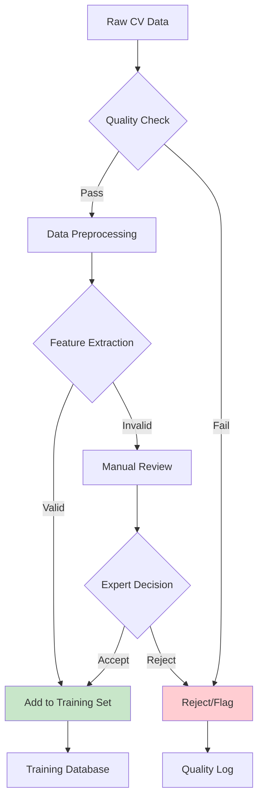

**Quality Criteria:**
- **Signal-to-noise ratio** > 10:1
- **Peak reproducibility** < 5% RSD
- **Baseline stability** < 1% drift
- **No artifacts** (spikes, dropouts)
- **Complete scan range** coverage

### 2. Data Annotation Guidelines

```yaml
annotation_standards:
  peak_detection:
    manual_annotation: true
    expert_validation: required
    confidence_scoring: 1-10
    inter_annotator_agreement: >85%
    
  concentration_labels:
    preparation_method: documented
    uncertainty: ±5%
    traceability: required
    calibration_verification: mandatory
    
  substance_identity:
    purity: >95%
    certificate_analysis: required
    storage_conditions: controlled
    expiry_tracking: mandatory
```

## Training Dataset Structure

### Database Schema for Training Data

```sql
-- Training datasets
CREATE TABLE training_datasets (
    id SERIAL PRIMARY KEY,
    dataset_name VARCHAR(100),
    dataset_type VARCHAR(50), -- 'peak_detection', 'quantitative', 'classification'
    version VARCHAR(20),
    creation_date TIMESTAMP,
    description TEXT,
    total_samples INTEGER,
    quality_score FLOAT
);

-- Training samples
CREATE TABLE training_samples (
    id SERIAL PRIMARY KEY,
    dataset_id INTEGER REFERENCES training_datasets(id),
    sample_id VARCHAR(50) UNIQUE,
    cv_data JSONB,
    labels JSONB,
    metadata JSONB,
    quality_flags JSONB,
    annotation_confidence FLOAT,
    created_at TIMESTAMP
);

-- Ground truth annotations
CREATE TABLE ground_truth_annotations (
    id SERIAL PRIMARY KEY,
    sample_id VARCHAR(50),
    annotation_type VARCHAR(50),
    annotator_id VARCHAR(50),
    annotation_data JSONB,
    confidence_score FLOAT,
    validation_status VARCHAR(20),
    created_at TIMESTAMP
);

-- Training model performance
CREATE TABLE model_training_results (
    id SERIAL PRIMARY KEY,
    model_name VARCHAR(100),
    dataset_version VARCHAR(20),
    training_date TIMESTAMP,
    performance_metrics JSONB,
    hyperparameters JSONB,
    cross_validation_scores JSONB,
    model_path VARCHAR(255)
);
```

## Data Collection Timeline

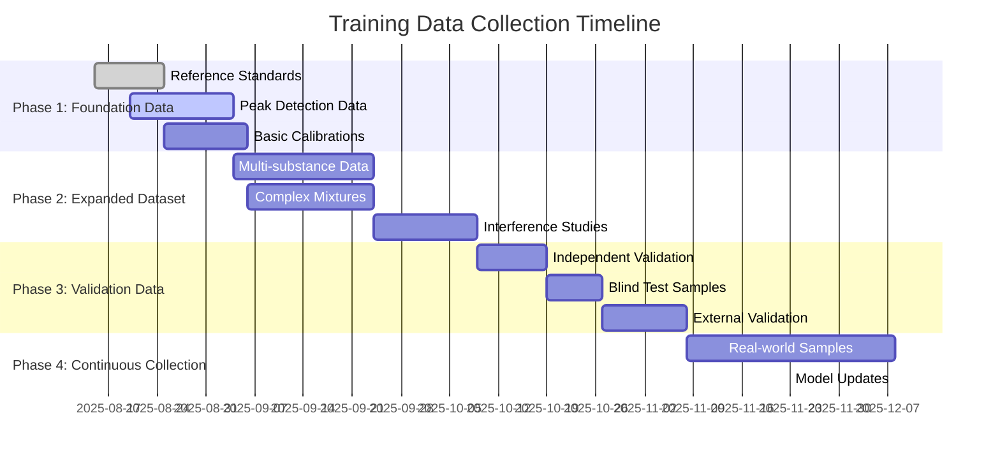

## Synthetic Data Generation

### 1. CV Curve Simulation

```python
def generate_synthetic_cv(
    substance_params: dict,
    noise_level: float = 0.01,
    baseline_drift: float = 0.001,
    scan_rate: float = 0.1
) -> dict:
    """
    Generate synthetic CV data with controlled parameters
    
    Parameters:
    - substance_params: E0, k0, alpha, concentration
    - noise_level: Gaussian noise standard deviation
    - baseline_drift: Linear baseline drift
    - scan_rate: Scan rate in V/s
    """
    pass
```

**Synthetic Data Benefits:**
- **Large volumes** (10,000+ curves quickly)
- **Controlled parameters** (known ground truth)
- **Edge cases** (extreme conditions)
- **Balanced datasets** (equal representation)
- **Cost effective** (no reagents needed)

### 2. Noise and Artifact Simulation

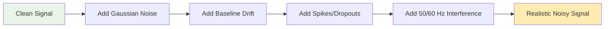

## Training Strategy

### 1. Progressive Training Approach

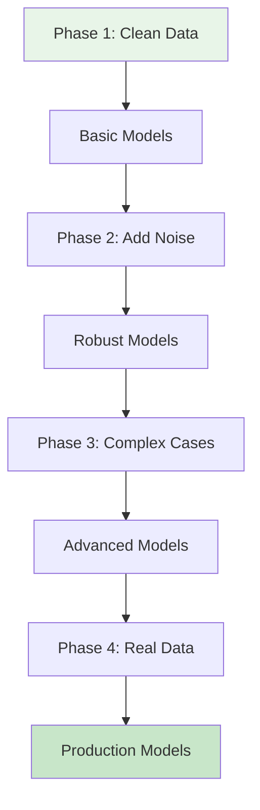

### 2. Cross-Validation Strategy

```python
# Training split strategy
train_split = 0.70  # 70% training
val_split = 0.15    # 15% validation  
test_split = 0.15   # 15% testing

# Time-series aware splits for temporal data
# Stratified splits for classification
# Group splits for substance-wise independence
```

### 3. Model Performance Targets

| **Model Type** | **Metric** | **Minimum** | **Target** | **Excellent** |
|----------------|------------|-------------|------------|---------------|
| **Peak Detection** | F1-Score | 0.85 | 0.90 | 0.95 |
| **Quantitative** | R² | 0.95 | 0.98 | 0.995 |
| **Concentration** | MAPE | <15% | <10% | <5% |
| **Classification** | Accuracy | 0.85 | 0.90 | 0.95 |

## Data Management Infrastructure

### 1. Storage Requirements

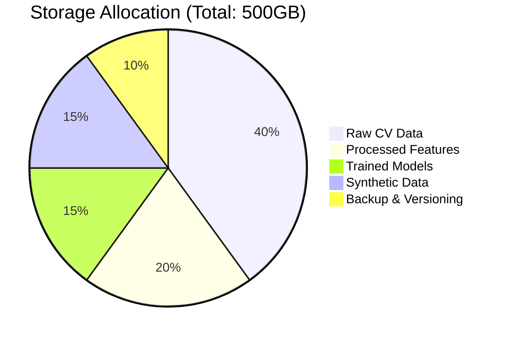

### 2. Data Pipeline

```mermaid
flowchart LR
    A[Data Collection] --> B[Quality Control]
    B --> C[Preprocessing]
    C --> D[Feature Extraction]
    D --> E[Data Augmentation]
    E --> F[Training Database]
    
    F --> G[Model Training]
    G --> H[Model Validation]
    H --> I[Model Deployment]
    
    J[Continuous Collection] --> B
    I --> K[Performance Monitoring]
    K --> J
    
    style F fill:#e3f2fd
    style I fill:#c8e6c9
```

## Implementation Priority

### Week 1-2: Foundation Dataset
- [ ] Set up data collection infrastructure
- [ ] Collect 100 reference standard measurements
- [ ] Generate 1,000 synthetic CV curves
- [ ] Create basic peak annotations

### Week 3-4: Quantitative Data
- [ ] Collect calibration data for 3 priority substances
- [ ] 50 points per substance (150 total)
- [ ] Validate linearity and reproducibility

### Week 5-6: Classification Data
- [ ] Collect 200 samples for 5 substance classes
- [ ] Include concentration variations
- [ ] Add interference studies

### Week 7-8: Validation & Testing
- [ ] Independent validation dataset
- [ ] Blind test samples
- [ ] Performance benchmarking

---
*ML Training Data Collection Plan*  
*Version: 1.0*  
*Created: August 15, 2025*
