# Multi-Technique Electrochemical Analysis Strategy

## Overview
การวางแผนการพัฒนาระบบวิเคราะห์สำหรับเทคนิคต่างๆ: CV, SWV, DPV, CA และเทคนิคอื่นๆ

## Current Status Analysis

### Cyclic Voltammetry (CV) - Current Focus


**Current Progress:**
- ✅ Architecture designed
- ✅ Training plan created
- 🚧 Implementation in progress
- ❌ Not yet validated

## Electrochemical Techniques Comparison

### 1. Technique Characteristics

| **Technique** | **Sensitivity** | **Speed** | **Complexity** | **Applications** | **STM32 Support** |
|---------------|-----------------|-----------|-----------------|------------------|-------------------|
| **CV** | Medium | Medium | Medium | General analysis | ✅ Current |
| **SWV** | High | Fast | Low | Trace analysis | ✅ Possible |
| **DPV** | High | Medium | Low | Metal detection | ✅ Possible |
| **CA** | Medium | Very Fast | Very Low | Kinetics | ✅ Easy |
| **LSV** | Medium | Fast | Low | Screening | ✅ Easy |
| **NPV** | Medium | Medium | Medium | Organics | ⚠️ Complex |

### 2. Implementation Difficulty vs Impact

```mermaid
quadrantChart
    title Implementation Strategy Matrix
    x-axis Low Difficulty --> High Difficulty
    y-axis Low Impact --> High Impact
    
    quadrant-1 Quick Wins (High Impact, Low Difficulty)
    quadrant-2 Strategic Projects (High Impact, High Difficulty)
    quadrant-3 Fill-ins (Low Impact, Low Difficulty)
    quadrant-4 Avoid (Low Impact, High Difficulty)
    
    "CV": [0.6, 0.8]
    "SWV": [0.4, 0.9]
    "DPV": [0.3, 0.8]
    "CA": [0.2, 0.6]
    "LSV": [0.3, 0.7]
    "NPV": [0.8, 0.5]
```

## Strategic Recommendations

### 🎯 **Recommendation: Phased Approach**

#### **Phase 1: Perfect CV (Current Focus) - 6 months**
**Reasoning:**
- CV is most complex technique - if we master it, others become easier
- Provides foundation architecture for all techniques
- Most comprehensive training dataset needed
- Peak detection algorithms transferable to other techniques

#### **Phase 2: Add High-Impact, Low-Complexity Techniques - 3 months**
1. **Square Wave Voltammetry (SWV)** - Priority #1
2. **Differential Pulse Voltammetry (DPV)** - Priority #2  
3. **Chronoamperometry (CA)** - Priority #3

#### **Phase 3: Advanced Techniques - 6 months**
4. **Linear Sweep Voltammetry (LSV)**
5. **Normal Pulse Voltammetry (NPV)**
6. **Specialized techniques** (based on user feedback)

## Detailed Phase 2 Planning

### 1. Square Wave Voltammetry (SWV)


**Advantages of SWV:**
- **Higher sensitivity** than CV (10-100x)
- **Faster analysis** (no reverse scan)
- **Better peak resolution**
- **Lower background current**

**Implementation Effort:** 🟢 Low-Medium
- Reuse 70% of CV infrastructure
- Simpler peak detection (single direction)
- Similar ML feature extraction

### 2. Differential Pulse Voltammetry (DPV)


**Advantages of DPV:**
- **Excellent for metal detection**
- **High sensitivity**
- **Good peak separation**
- **Widely used in industry**

**Implementation Effort:** 🟢 Low
- Very similar to SWV
- Simpler waveform
- Well-established theory

### 3. Chronoamperometry (CA)


**Advantages of CA:**
- **Simplest technique** to implement
- **Fast measurements** (seconds)
- **Good for kinetic studies**
- **No peak detection needed**

**Implementation Effort:** 🟢 Very Low
- No complex peak detection
- Simple curve fitting
- Minimal new infrastructure

## Shared Infrastructure Design

### 1. Unified Architecture for All Techniques


### 2. Shared Components (70-80% Reuse)


## Implementation Timeline

### Current Timeline Extension


### Resource Allocation


## Risk Analysis

### 1. Risks of Early Multi-Technique Development


### 2. Risks of Sequential Development


## Recommended Strategy: **"CV-First with Early Planning"**

### 1. Current Phase: CV Excellence (6 months)
- ✅ **Focus 100% on CV** until production-ready
- ✅ **Design architecture** to support multiple techniques
- ✅ **Document learnings** for technique expansion
- ✅ **Validate ML approach** with CV data

### 2. Preparation Phase (Parallel with CV)
- 📋 **Research SWV/DPV requirements** 
- 📋 **Design unified data models**
- 📋 **Plan STM32 firmware extensions**
- 📋 **Identify shared components**

### 3. Rapid Expansion Phase (3 months)
- 🚀 **Add SWV** (highest impact, reuses 70% of CV)
- 🚀 **Add DPV** (similar to SWV, fast implementation)
- 🚀 **Add CA** (simplest, good for validation)

## Technical Feasibility Assessment

### STM32 Capability Analysis

```mermaid
graph TB
    subgraph "STM32 H743 Capabilities"
        A[12-bit DAC] --> B[CV: ✅ Sufficient]
        A --> C[SWV: ✅ Sufficient]
        A --> D[DPV: ✅ Sufficient]
        
        E[480 MHz CPU] --> F[Real-time Processing: ✅]
        G[2MB Flash] --> H[Multiple Techniques: ✅]
        I[1MB RAM] --> J[Data Buffering: ✅]
    end
    
    style B fill:#c8e6c9
    style C fill:#c8e6c9
    style D fill:#c8e6c9
    style F fill:#c8e6c9
    style H fill:#c8e6c9
    style J fill:#c8e6c9
```



### Code Reusability Analysis

| **Component** | **CV** | **SWV** | **DPV** | **CA** | **Reuse %** |
|---------------|--------|---------|---------|--------|-------------|
| Data Models | ✅ | ✅ | ✅ | ✅ | 100% |
| STM32 Comm | ✅ | ✅ | ✅ | ✅ | 90% |
| Preprocessing | ✅ | ✅ | ✅ | ⚠️ | 80% |
| Peak Detection | ✅ | ✅ | ✅ | ❌ | 70% |
| ML Features | ✅ | ✅ | ✅ | ⚠️ | 60% |
| Visualization | ✅ | ✅ | ✅ | ⚠️ | 80% |
| Web Interface | ✅ | ✅ | ✅ | ✅ | 95% |

## Final Recommendation

### 🎯 **Strategic Decision: "CV-First Excellence"**

**Why this approach:**

1. **Technical Soundness** 🔧
   - CV is most complex → solving it enables easier expansion
   - Architecture lessons learned apply to all techniques
   - ML models can be adapted with minimal changes

2. **Business Sense** 💼
   - Faster time-to-market for first technique
   - Proven success before resource expansion
   - Lower risk of incomplete implementations

3. **Resource Efficiency** ⚡
   - Team focuses expertise on one technique first
   - Quality over quantity approach
   - Sustainable development pace

4. **User Value** 👥
   - Deliver excellent CV analysis first
   - Build user trust and feedback
   - Expand based on actual user needs

### 📅 **Recommended Timeline:**
- **Now - February 2026**: Perfect CV analysis
- **March - May 2026**: Add SWV, DPV, CA (3 months for all three)
- **June 2026+**: Advanced techniques based on user demand

### 🚨 **Success Criteria for Phase 2 Trigger:**
- CV system achieves >95% accuracy in production
- User base actively using CV features
- Technical architecture proven scalable
- Development team confident in approach

---
**คำแนะนำ**: เน้นทำ CV ให้สมบูรณ์แบบก่อน แล้วจึงขยายไปเทคนิคอื่น เพราะจะได้ประโยชน์สูงสุดจากการใช้โครงสร้างร่วมกัน และลดความเสี่ยงในการพัฒนา

---
*Multi-Technique Strategy Document*  
*Version: 1.0*  
*Created: August 15, 2025*
