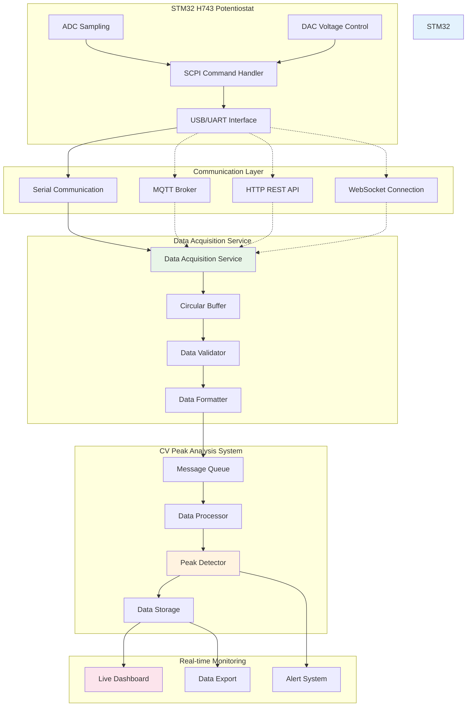
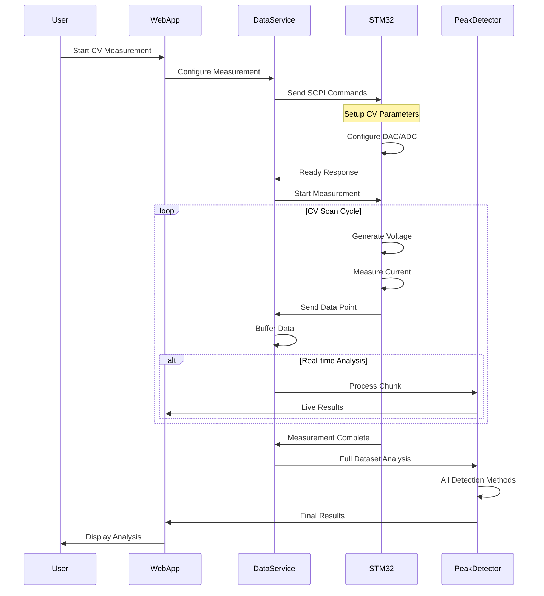
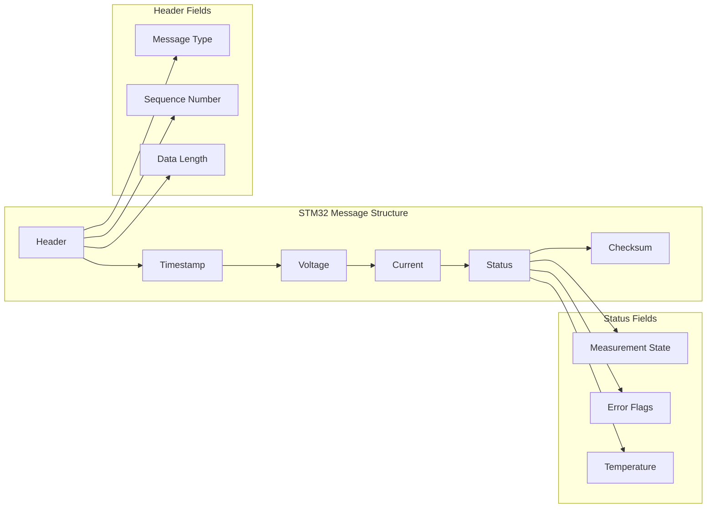
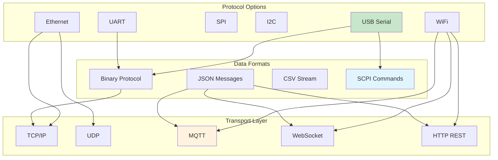
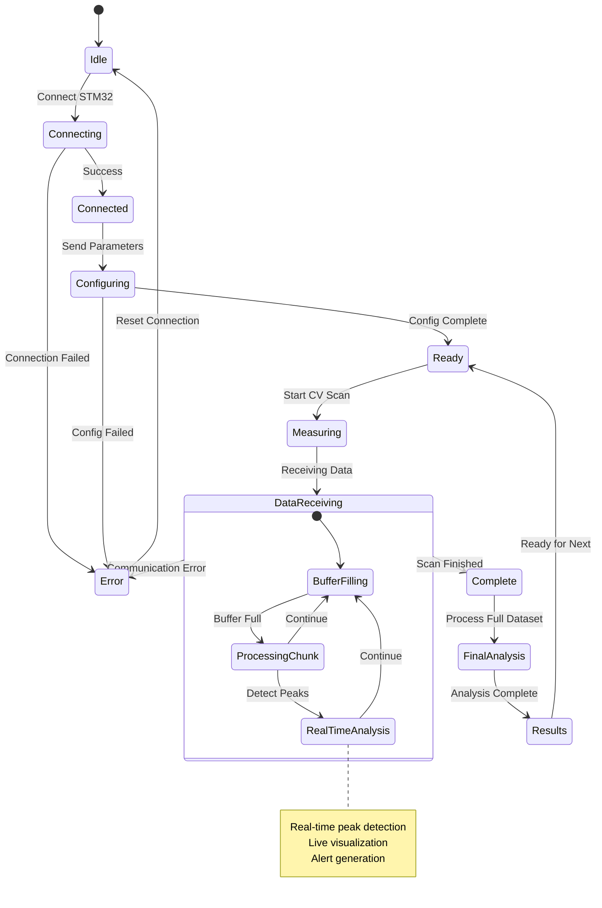
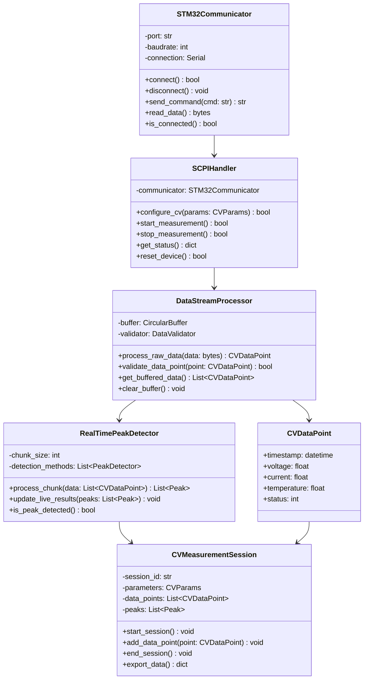
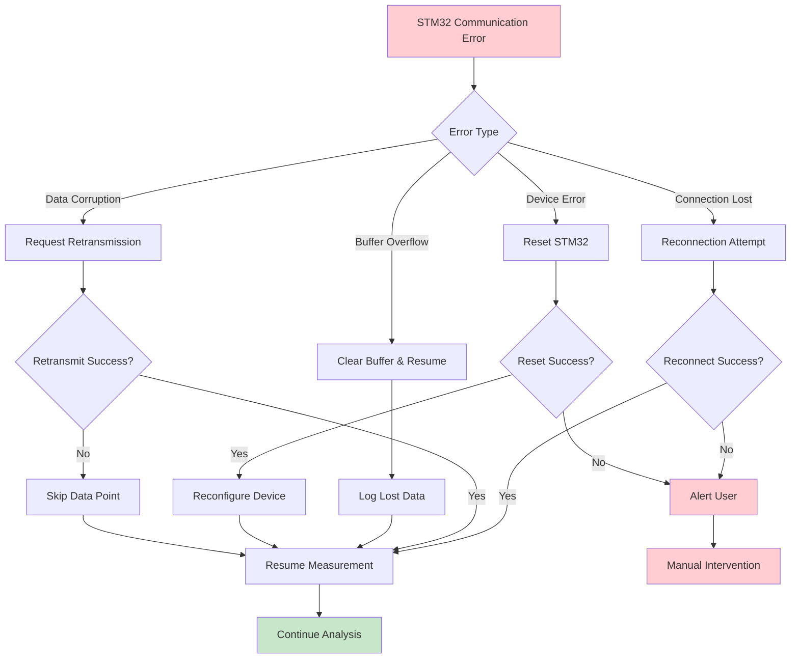
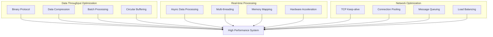
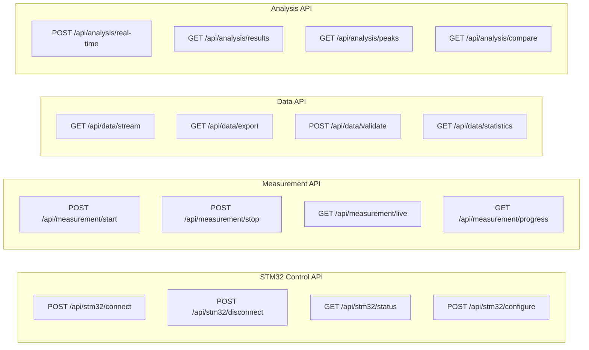

# STM32 to CV Peak Analysis Integration Plan

## Overview
แผนการเชื่อมต่อข้อมูล Cyclic Voltammetry จาก STM32 H743 Potentiostat เข้าสู่ระบบวิเคราะห์ Peak Detection

## Data Flow Architecture



## STM32 Data Protocol Design



## Data Message Format



## Communication Protocols



## Real-time Data Processing Flow



## STM32 Integration Components



## Configuration and Setup

```yaml
# config/stm32_integration.yaml
stm32:
  communication:
    protocol: "usb_serial"  # usb_serial, uart, ethernet
    port: "COM3"           # Windows: COMx, Linux: /dev/ttyUSBx
    baudrate: 115200
    timeout: 5
    
  scpi:
    command_timeout: 2
    response_buffer_size: 1024
    error_retry_count: 3
    
  data_acquisition:
    buffer_size: 10000
    chunk_size: 100
    sampling_rate: 1000  # Hz
    
measurement:
  cv_parameters:
    voltage_min: -1.0    # V
    voltage_max: 1.0     # V
    scan_rate: 0.1       # V/s
    cycles: 3
    
  real_time:
    enable_live_detection: true
    live_update_interval: 100  # ms
    peak_threshold: 1e-6   # A
    
peak_detection:
  methods:
    - "traditional"
    - "statistical"
    - "ml"
  
  real_time_method: "statistical"  # Fastest for real-time
  
storage:
  auto_save: true
  save_format: "hdf5"  # hdf5, csv, json
  compression: true
```

## Error Handling and Recovery



## Performance Optimization



## API Endpoints for STM32 Integration



## Implementation Priority

### Phase 1: Basic Communication (Week 1)
- [ ] STM32 USB/Serial communication
- [ ] Basic SCPI command handling
- [ ] Data point structure definition
- [ ] Simple data validation

### Phase 2: Data Streaming (Week 2)
- [ ] Real-time data streaming
- [ ] Circular buffer implementation
- [ ] Error handling and recovery
- [ ] Basic live visualization

### Phase 3: Integration (Week 3)
- [ ] Connect to existing CV analysis system
- [ ] Real-time peak detection
- [ ] Live dashboard updates
- [ ] Data persistence

### Phase 4: Optimization (Week 4)
- [ ] Performance optimization
- [ ] Advanced error handling
- [ ] Multi-session support
- [ ] Export functionality

---
*STM32 Integration Plan*  
*Version: 1.0*  
*Created: August 15, 2025*
