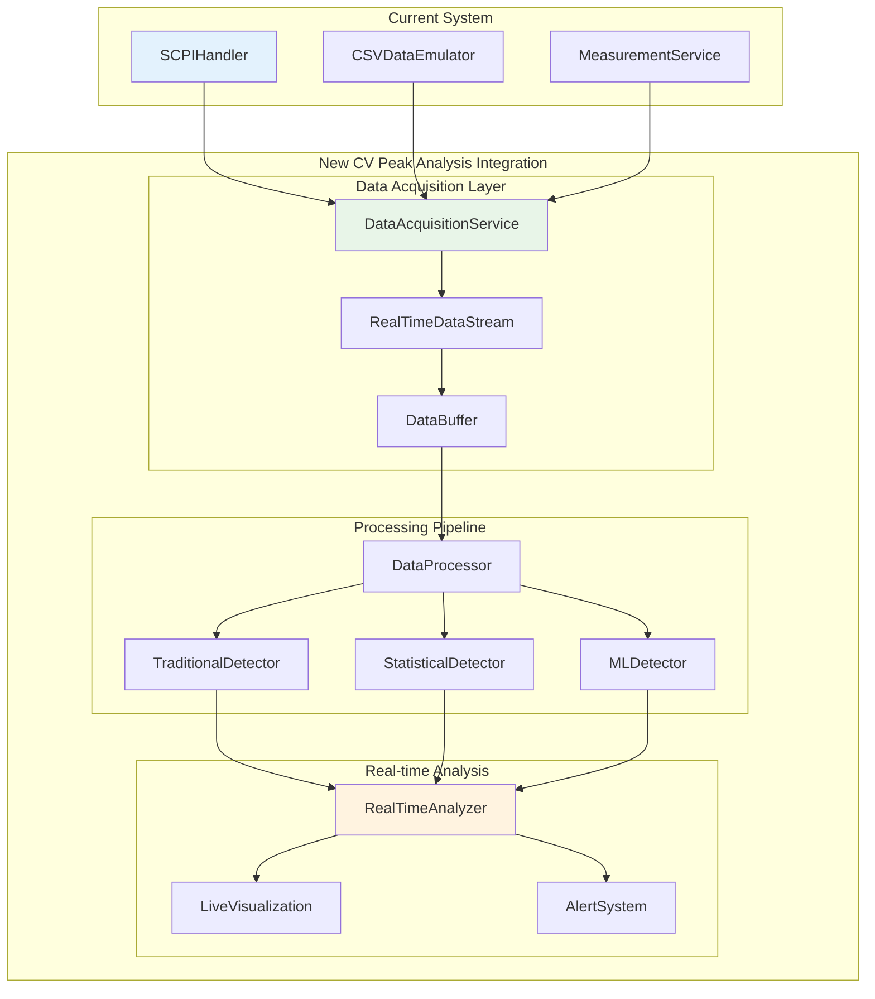
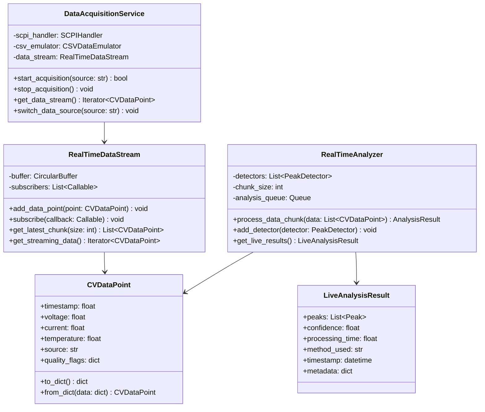
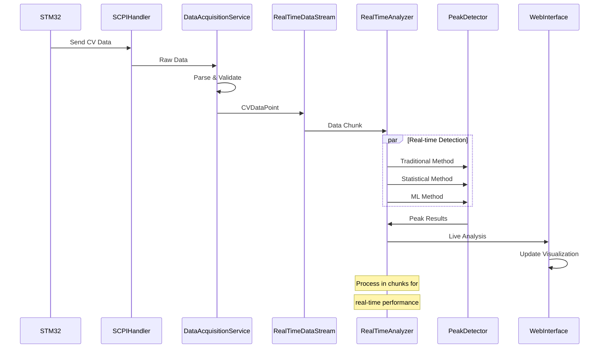
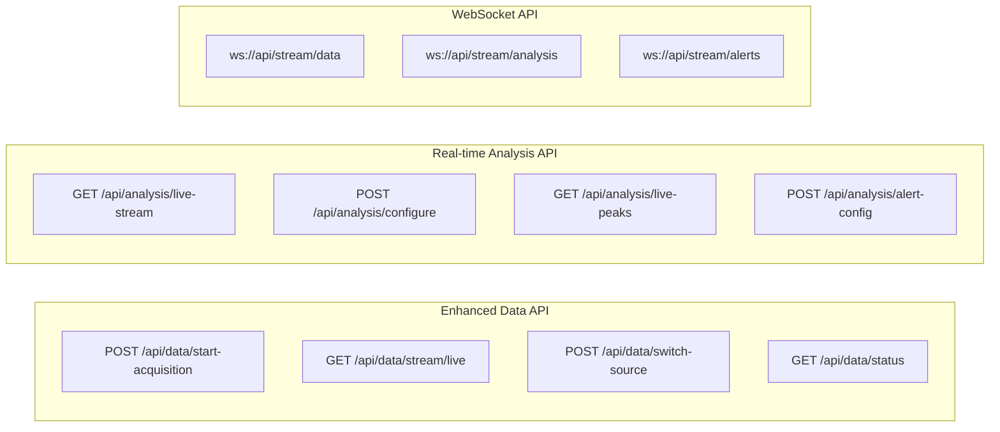
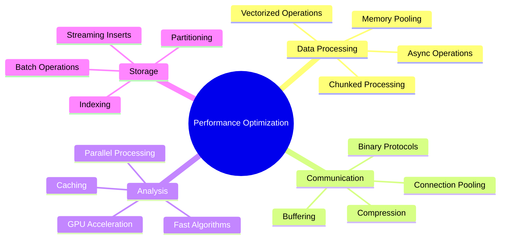
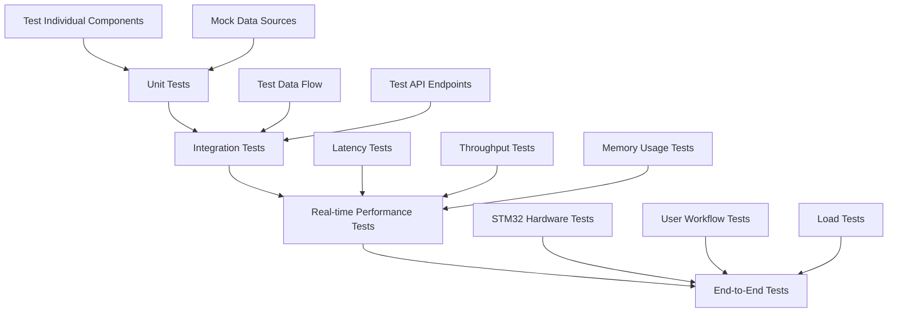

# STM32 Integration Enhancement Plan

## Current System Analysis

ระบบปัจจุบันมีส่วนประกอบดังนี้:
- `SCPIHandler`: จัดการการสื่อสาร Serial กับ STM32
- `CSVDataEmulator`: จำลองข้อมูลจาก CSV files  
- `measurement_service.py`: บริการจัดการการวัด

## Enhanced Integration Architecture



## Code Structure Enhancement



## File Modifications Required

### 1. Enhanced SCPIHandler (src/hardware/scpi_handler.py)

```python
# Additional methods to add:

def start_cv_measurement(self, params: dict) -> bool:
    """Start CV measurement with specified parameters"""
    
def get_measurement_data(self) -> List[CVDataPoint]:
    """Get measurement data as structured data points"""
    
def configure_real_time_streaming(self, enable: bool = True) -> bool:
    """Configure real-time data streaming from STM32"""
    
def get_device_status(self) -> dict:
    """Get comprehensive device status"""
```

### 2. Enhanced CSVDataEmulator (src/hardware/csv_data_emulator.py)

```python
# Additional methods to add:

def get_data_stream(self) -> Iterator[CVDataPoint]:
    """Get data as a stream compatible with real-time processing"""
    
def simulate_real_time_measurement(self, callback: Callable) -> None:
    """Simulate real-time measurement with callback"""
    
def get_standardized_data_point(self, index: int) -> CVDataPoint:
    """Get data point in standardized format"""
```

### 3. New DataAcquisitionService

```python
# New file: src/services/data_acquisition_service.py

class DataAcquisitionService:
    """Unified service for acquiring data from various sources"""
    
    def __init__(self):
        self.scpi_handler = SCPIHandler()
        self.csv_emulator = CSVDataEmulator()
        self.current_source = None
        self.data_stream = RealTimeDataStream()
        
    def start_acquisition(self, source: str, **kwargs) -> bool:
        """Start data acquisition from specified source"""
        
    def get_unified_data_stream(self) -> Iterator[CVDataPoint]:
        """Get unified data stream regardless of source"""
```

## Real-time Processing Pipeline



## Configuration Updates

```yaml
# config/data_acquisition.yaml
data_acquisition:
  sources:
    stm32:
      enabled: true
      default_port: "COM3"
      baudrate: 115200
      timeout: 5
      
    csv_emulation:
      enabled: true
      default_file: "sample_data/cv_sample.csv"
      playback_speed: 1.0
      
  real_time:
    buffer_size: 1000
    chunk_size: 50
    processing_interval: 100  # ms
    max_latency: 500  # ms
    
  data_validation:
    enable_quality_checks: true
    voltage_range: [-2.0, 2.0]  # V
    current_range: [-1e-3, 1e-3]  # A
    
peak_detection:
  real_time:
    methods: ["statistical"]  # Fast methods for real-time
    confidence_threshold: 0.7
    
  batch:
    methods: ["traditional", "statistical", "ml"]  # All methods for final analysis
```

## API Endpoints Enhancement



## Database Schema for Real-time Data

```sql
-- Real-time measurement sessions
CREATE TABLE measurement_sessions (
    id SERIAL PRIMARY KEY,
    session_id VARCHAR(50) UNIQUE,
    start_time TIMESTAMP,
    end_time TIMESTAMP,
    data_source VARCHAR(20),
    parameters JSONB,
    status VARCHAR(20),
    total_points INTEGER,
    created_at TIMESTAMP DEFAULT NOW()
);

-- Real-time data points (optional storage)
CREATE TABLE real_time_data_points (
    id BIGSERIAL PRIMARY KEY,
    session_id VARCHAR(50),
    timestamp DOUBLE PRECISION,
    voltage DOUBLE PRECISION,
    current DOUBLE PRECISION,
    temperature DOUBLE PRECISION,
    quality_flags JSONB,
    created_at TIMESTAMP DEFAULT NOW()
);

-- Real-time peak detections
CREATE TABLE real_time_peaks (
    id SERIAL PRIMARY KEY,
    session_id VARCHAR(50),
    detection_timestamp TIMESTAMP,
    peak_type VARCHAR(10),
    voltage DOUBLE PRECISION,
    current DOUBLE PRECISION,
    method VARCHAR(20),
    confidence DOUBLE PRECISION,
    metadata JSONB
);

-- Indexes for performance
CREATE INDEX idx_session_timestamp ON real_time_data_points(session_id, timestamp);
CREATE INDEX idx_peaks_session ON real_time_peaks(session_id);
```

## Performance Optimization Strategies



## Implementation Timeline

### Week 1: Foundation
- [ ] Create DataAcquisitionService
- [ ] Enhance SCPIHandler with streaming
- [ ] Implement RealTimeDataStream
- [ ] Basic WebSocket support

### Week 2: Real-time Analysis
- [ ] Create RealTimeAnalyzer
- [ ] Integrate with existing peak detectors
- [ ] Implement live visualization updates
- [ ] Add quality validation

### Week 3: Integration
- [ ] Connect all components
- [ ] Database schema implementation
- [ ] API endpoint creation
- [ ] Testing with real STM32

### Week 4: Optimization
- [ ] Performance tuning
- [ ] Error handling
- [ ] Documentation
- [ ] User interface improvements

## Testing Strategy



---
*STM32 Integration Enhancement Plan*  
*Version: 1.0*  
*Created: August 15, 2025*
